# Forumline System Architecture

> Every box is a single swappable component. Every line is a real connection.
> If you can rip it out and replace it independently, it gets its own box.

```mermaid
graph TB
    %% ═══════════════════════════════════════════════
    %% CLIENTS
    %% ═══════════════════════════════════════════════
    Browser["Browser"]
    DevLaptop["Developer Laptop"]

    %% ═══════════════════════════════════════════════
    %% INDEPENDENT SERVICES — each independently swappable
    %% ═══════════════════════════════════════════════

    %% Cloudflare (each a separate product)
    Tunnel["Cloudflare Tunnel<br/>b00696cc..."]
    R2["Cloudflare R2<br/>Bucket: forumline-avatars<br/>pub-9fed...r2.dev"]
    DNS["Cloudflare DNS<br/>forumline.net zone"]
    StatusWorker["Status Redirect Worker<br/>Cloudflare Workers"]
    Uptimer["Uptimer<br/>status.forumline.net<br/>Workers + Pages + D1"]
    ZeroTrust["Cloudflare Zero Trust<br/>Service token auth<br/>SSH bastion policy"]

    %% Voice & media
    LiveKit["LiveKit Cloud<br/>SFU · Voice Rooms"]
    GoogleSTUN["Google STUN<br/>stun.l.google.com:19302<br/>WebRTC ICE"]

    %% Email
    Resend["Resend SMTP<br/>smtp.resend.com:465<br/>noreply@forumline.net"]

    %% GitHub (each independently swappable)
    GitHubRepos["GitHub Repos<br/>forumline monorepo<br/>+ forum-server split"]
    GitHubActions["GitHub Actions<br/>Package publishing"]
    GitHubPackages["GitHub Packages<br/>npm registry<br/>@forumline scope"]

    %% Avatar generation
    DiceBear["DiceBear API<br/>avataaars + shapes styles<br/>Deterministic avatars"]

    %% Infrastructure tools (run inside Dagger)
    OpenTofu["OpenTofu 1.11.5<br/>Cloudflare infra management<br/>State in R2"]
    SOPS["SOPS + Age<br/>Secrets encryption<br/>.env.enc files"]

    %% ═══════════════════════════════════════════════
    %% PROXMOX HOST (The "motherboard" — real physical grouping)
    %% ═══════════════════════════════════════════════
    subgraph Proxmox["PROXMOX HOST · 192.168.1.98"]
        WireGuard["WireGuard VPN<br/>10.10.0.0/24 · :51820"]
        Cloudflared["Cloudflared Daemon<br/>Tunnel connector"]

        subgraph CT101["CT 101 · forumline-prod · 192.168.1.99"]
            FL_API["Forumline API<br/>Go · stdlib ServeMux<br/>:3000"]
            FL_SPA["Forumline Web SPA<br/>Vanilla TS · Vite"]
            FL_PG[("Postgres 17<br/>forumline_* tables<br/>LISTEN/NOTIFY")]
            FL_Vector["Vector 0.45.0"]
        end

        subgraph CT100["CT 100 · forum-prod · 192.168.1.23"]
            Forum_API["Forum Server<br/>Go · Chi v5<br/>:3000"]
            Forum_FE["Forum Frontend<br/>Vanilla JS · Vite · Tailwind"]
            Forum_PG[("Postgres 17<br/>threads, posts, chat<br/>LISTEN/NOTIFY")]
            Forum_Vector["Vector 0.45.0"]
            Forum_Health["Health Check<br/>cron · every 5min<br/>Resend alert on failure"]
        end

        subgraph CT104["CT 104 · hosted-prod · 192.168.1.107"]
            Hosted_API["Hosted Server<br/>Go · Chi v5<br/>:3000"]
            Hosted_FE["Forum Frontend<br/>default tenant template"]
            Hosted_Citus[("Citus 13.0<br/>Schema-per-tenant<br/>platform_tenants")]
            Hosted_Vector["Vector 0.45.0"]
        end

        subgraph CT106["CT 106 · auth-prod · 192.168.1.110"]
            Zitadel["Zitadel v4.11<br/>OIDC/OAuth2 Provider<br/>:8080"]
            Zitadel_PG[("Postgres 17<br/>Zitadel-managed")]
            Auth_Vector["Vector 0.45.0"]
        end

        subgraph CT103["CT 103 · website-prod · 192.168.1.106"]
            Website_Nginx["Nginx<br/>Alpine · :3000"]
            Website_Content["Static Website<br/>HTML/CSS<br/>Neocities aesthetic"]
            Web_Vector["Vector 0.45.0"]
        end

        subgraph CT105["CT 105 · logs-prod · 192.168.1.108"]
            VLogs["VictoriaLogs<br/>:9428 · 30-day retention<br/>LogsQL · vmui web UI"]
        end

        subgraph CT102["CT 102 · ci-docker · 192.168.1.112"]
            Woodpecker["Woodpecker CI<br/>:8000 web · :9000 gRPC"]
            Dagger["Dagger v0.20.1<br/>Containerized CI engine"]
        end
    end

    %% ═══════════════════════════════════════════════
    %% CONNECTIONS — Clients → Tunnel
    %% ═══════════════════════════════════════════════
    Browser --> Tunnel
    DevLaptop -->|"WireGuard VPN"| WireGuard

    %% ═══════════════════════════════════════════════
    %% CONNECTIONS — DNS → Tunnel, Tunnel → Cloudflared → LXCs
    %% ═══════════════════════════════════════════════
    DNS -->|"*.forumline.net CNAME"| Tunnel
    Tunnel --> Cloudflared
    Cloudflared -->|"app.forumline.net"| FL_API
    Cloudflared -->|"demo.forumline.net"| Forum_API
    Cloudflared -->|"*.forumline.net"| Hosted_API
    Cloudflared -->|"auth.forumline.net"| Zitadel
    Cloudflared -->|"forumline.net"| Website_Nginx
    Cloudflared -->|"ci.forumline.net"| Woodpecker
    ZeroTrust -->|"ssh.forumline.net · CI only"| Proxmox

    %% ═══════════════════════════════════════════════
    %% CONNECTIONS — Status & monitoring
    %% ═══════════════════════════════════════════════
    StatusWorker -.->|"proxy healthy · redirect on 502"| Tunnel
    Uptimer -.->|"health checks every 60s"| Tunnel

    %% ═══════════════════════════════════════════════
    %% CONNECTIONS — Internal: service → database & frontend
    %% ═══════════════════════════════════════════════
    FL_API --> FL_PG
    FL_SPA -.->|"served by"| FL_API
    Forum_API --> Forum_PG
    Forum_FE -.->|"served by"| Forum_API
    Hosted_API --> Hosted_Citus
    Hosted_FE -.->|"served by"| Hosted_API
    Zitadel --> Zitadel_PG
    Website_Content -.->|"served by"| Website_Nginx

    %% ═══════════════════════════════════════════════
    %% CONNECTIONS — Internal: service → service
    %% ═══════════════════════════════════════════════
    FL_API -->|"OIDC · JWKS"| Zitadel
    Forum_API -->|"OIDC client"| Zitadel
    Hosted_API -->|"OIDC · provision apps"| Zitadel
    Forum_API -->|"webhook notifications"| FL_API

    %% ═══════════════════════════════════════════════
    %% CONNECTIONS — Services → External
    %% ═══════════════════════════════════════════════
    FL_API --> R2
    Forum_API --> R2
    Hosted_API --> R2

    Forum_API --> LiveKit
    Hosted_API --> LiveKit

    FL_API --> Resend
    Forum_Health -->|"alert on failure"| Resend

    FL_SPA --> DiceBear
    Forum_FE --> DiceBear

    %% ═══════════════════════════════════════════════
    %% CONNECTIONS — WebRTC
    %% ═══════════════════════════════════════════════
    FL_API -->|"WebRTC P2P signaling via SSE"| Browser
    Browser -->|"ICE candidates"| GoogleSTUN

    %% ═══════════════════════════════════════════════
    %% CONNECTIONS — Push notifications
    %% ═══════════════════════════════════════════════
    FL_API -->|"VAPID Web Push"| Browser

    %% ═══════════════════════════════════════════════
    %% CONNECTIONS — Log shipping
    %% ═══════════════════════════════════════════════
    FL_Vector -->|"Loki push"| VLogs
    Forum_Vector -->|"Loki push"| VLogs
    Hosted_Vector -->|"Loki push"| VLogs
    Auth_Vector -->|"Loki push"| VLogs
    Web_Vector -->|"Loki push"| VLogs
    WireGuard -.->|"dev access"| VLogs

    %% ═══════════════════════════════════════════════
    %% CONNECTIONS — CI/CD
    %% ═══════════════════════════════════════════════
    GitHubRepos -->|"push webhook"| Woodpecker
    Woodpecker --> Dagger
    Dagger -->|"SSH deploy"| CT101
    Dagger -->|"SSH deploy"| CT100
    Dagger -->|"SSH deploy"| CT104
    Dagger -->|"SSH deploy"| CT106
    Dagger -->|"SSH deploy"| CT103
    Dagger -->|"SSH deploy"| CT105
    Dagger --> SOPS
    Dagger --> OpenTofu
    OpenTofu -->|"manages"| Tunnel
    OpenTofu -->|"manages"| ZeroTrust
    SOPS -->|"decrypts .env.enc"| Dagger

    %% ═══════════════════════════════════════════════
    %% CONNECTIONS — Distribution
    %% ═══════════════════════════════════════════════
    GitHubActions -->|"publish"| GitHubPackages

    %% ═══════════════════════════════════════════════
    %% STYLING
    %% ═══════════════════════════════════════════════
    style Proxmox fill:#1a1a2e,color:#e0e0e0,stroke:#4a4a8a
    style CT101 fill:#16213e,color:#e0e0e0,stroke:#0f3460
    style CT100 fill:#16213e,color:#e0e0e0,stroke:#0f3460
    style CT104 fill:#16213e,color:#e0e0e0,stroke:#0f3460
    style CT106 fill:#16213e,color:#e0e0e0,stroke:#0f3460
    style CT103 fill:#16213e,color:#e0e0e0,stroke:#0f3460
    style CT105 fill:#1a3a1a,color:#e0e0e0,stroke:#2d6a2d
    style CT102 fill:#3a1a1a,color:#e0e0e0,stroke:#6a2d2d
```



## Quick Reference

| Domain | Routes To | LXC | IP | Container |
|--------|-----------|-----|-----|-----------|
| `app.forumline.net` | Forumline API + SPA | CT 101 | 192.168.1.99 | Go + Vite |
| `demo.forumline.net` | Demo Forum | CT 100 | 192.168.1.23 | Go + Vite |
| `*.forumline.net` | Hosted Multi-Tenant | CT 104 | 192.168.1.107 | Go + Citus |
| `auth.forumline.net` | Zitadel OIDC | CT 106 | 192.168.1.110 | Zitadel |
| `forumline.net` | Static Website | CT 103 | 192.168.1.106 | Nginx |
| `ci.forumline.net` | Woodpecker CI | CT 102 | 192.168.1.112 | Woodpecker |
| `status.forumline.net` | Uptimer | — | Cloudflare | Workers + D1 |
| (VPN only) | VictoriaLogs | CT 105 | 192.168.1.108 | VictoriaLogs |
| `ssh.forumline.net` | SSH Bastion | — | Proxmox host | CI only |

## Data Flow Cheat Sheet

```
User Request:  Browser → Cloudflare DNS → Tunnel → Cloudflared → LXC → Go API → Postgres
Voice Room:    Browser → LiveKit Cloud (SFU) ← Browser
1:1 Call:      Browser ←→ WebRTC P2P (signaled via SSE, ICE via Google STUN)
Push Notify:   Postgres NOTIFY → Go API → VAPID Web Push → Browser
Log Pipeline:  Docker Container → Vector Agent → VictoriaLogs (:9428)
Deploy:        git push → GitHub Repos → Woodpecker → Dagger → SOPS decrypt → SSH to LXC → docker compose up
Infra Change:  Dagger → OpenTofu → Cloudflare (Tunnel + Zero Trust)
Auth:          Any service → Zitadel OIDC (auth.forumline.net) → Postgres
Avatars:       Go API → Cloudflare R2 → CDN public URL
Fallback Avs:  Frontend → DiceBear API → SVG (seeded by user/thread ID)
```
