# Forumline Architecture Diagrams

## 1. High-Level System Overview

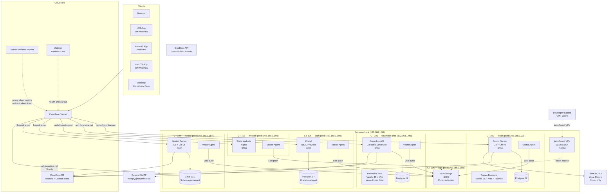

## 2. Application Architecture — Forumline App

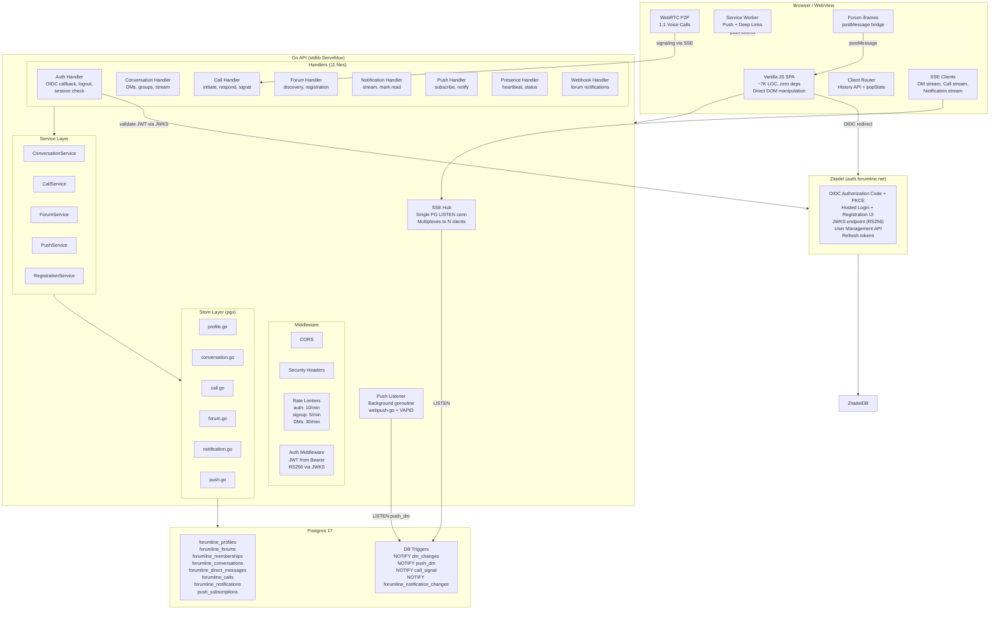

## 3. Application Architecture — Forum Server

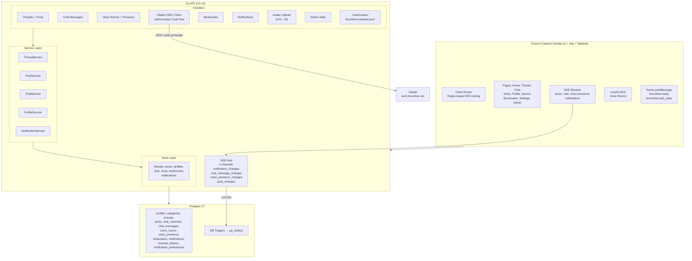

## 4. Hosted Multi-Tenant Architecture

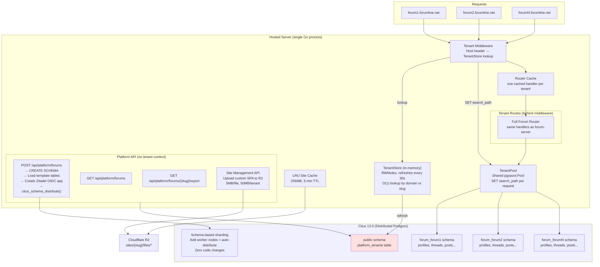

## 5. SSE Real-Time Architecture

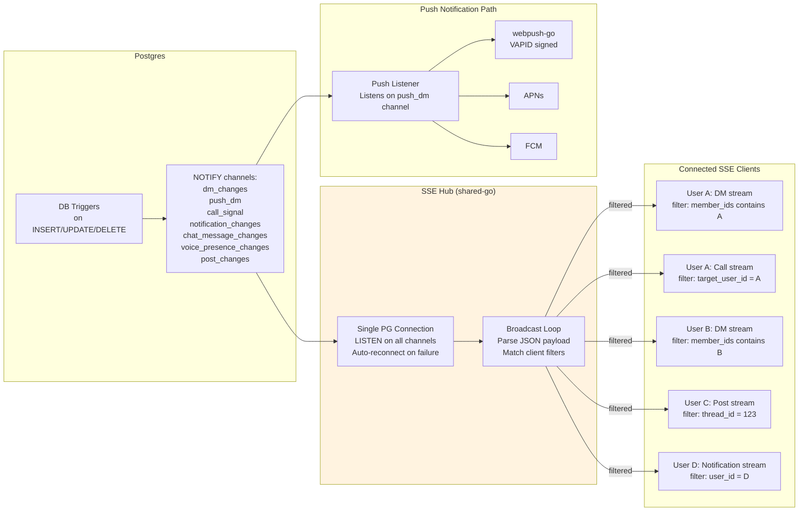

## 6. Federation Protocol — Forum Discovery & OIDC

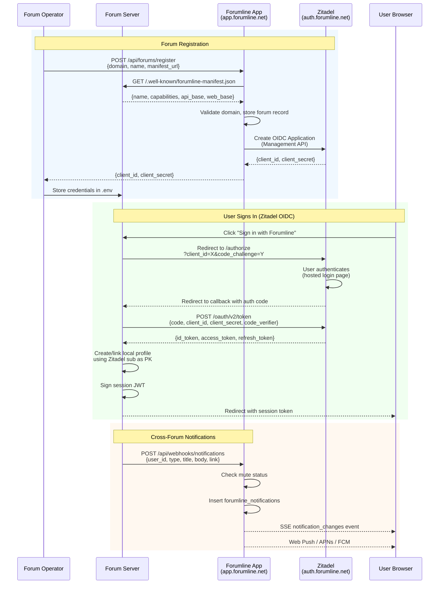

## 7. Monorepo Structure & Build Pipeline

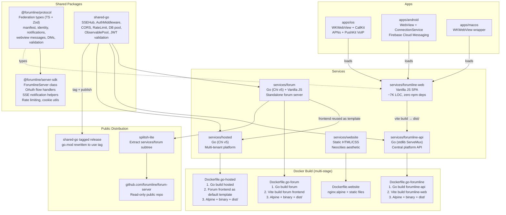

## 8. Deploy Pipeline

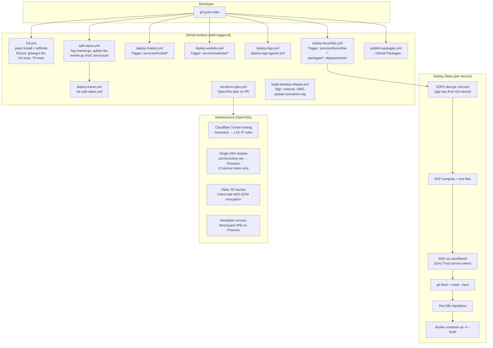

## 9. Voice & Calls Architecture

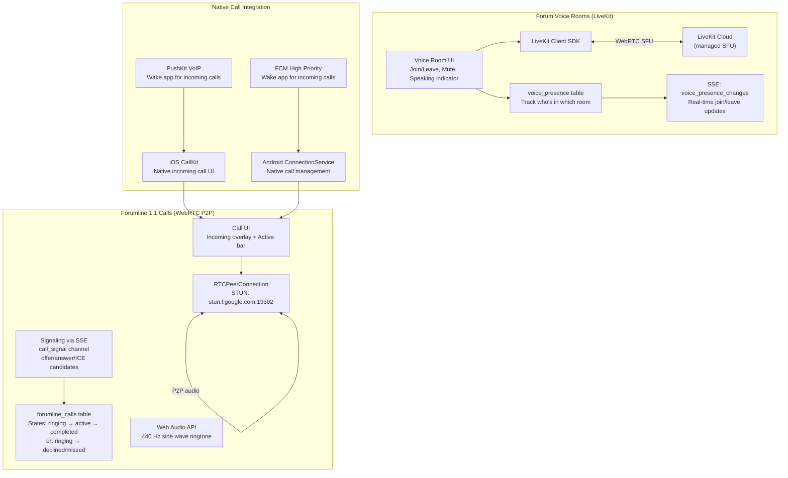

## 10. Native App Bridge Architecture

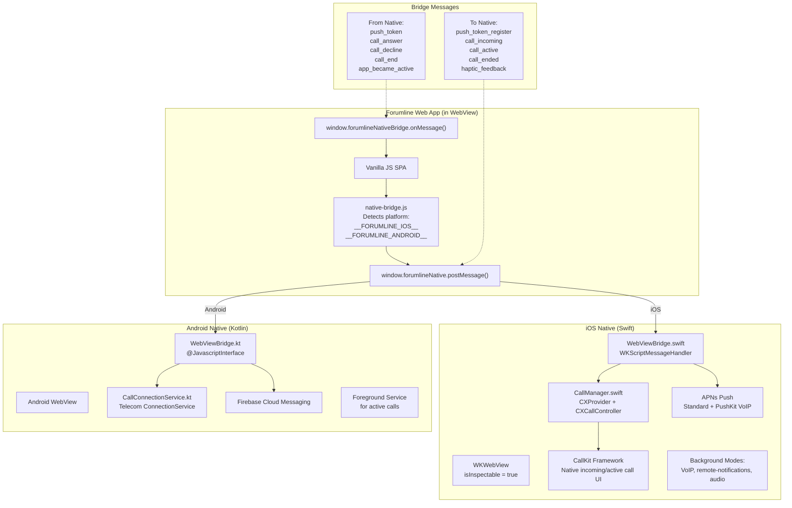

## 11. Database Schema Overview

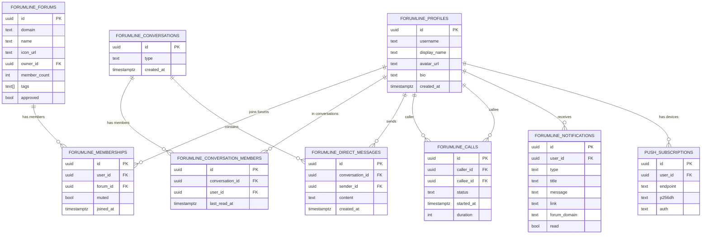

## 12. Logging & Observability

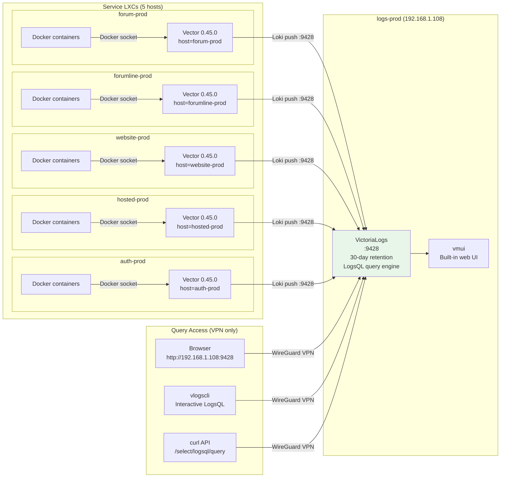
