# Forumline System Architecture

> Every box is a single swappable component. Every line is a real connection.
> If you can rip it out and replace it independently, it gets its own box.

```mermaid
graph TB
    %% ═══════════════════════════════════════════════
    %% CLIENTS
    %% ═══════════════════════════════════════════════
    Browser["Browser"]
    DevLaptop["Developer Laptop"]

    %% ═══════════════════════════════════════════════
    %% INDEPENDENT SERVICES — each independently swappable
    %% ═══════════════════════════════════════════════

    %% Cloudflare (each a separate product)
    Tunnel["Cloudflare Tunnel<br/>b00696cc..."]
    R2["Cloudflare R2<br/>Bucket: forumline-avatars<br/>pub-9fed...r2.dev"]
    DNS["Cloudflare DNS<br/>forumline.net zone"]
    Pages["Cloudflare Pages<br/>forumline.net<br/>Static website"]
    StatusWorker["Status Redirect Worker<br/>Cloudflare Workers"]
    Uptimer["Uptimer<br/>status.forumline.net<br/>Workers + Pages + D1"]
    ZeroTrust["Cloudflare Zero Trust<br/>Service token auth<br/>SSH bastion policy"]

    %% Voice & media
    LiveKit["LiveKit Cloud<br/>SFU · Calls + Voice Rooms"]

    %% Email
    Resend["Resend SMTP<br/>smtp.resend.com:465<br/>noreply@forumline.net"]

    %% GitHub (each independently swappable)
    GitHubRepos["GitHub Repos<br/>forumline monorepo"]
    GitHubActions["GitHub Actions<br/>Package publishing"]
    GitHubPackages["GitHub Packages<br/>npm registry<br/>@forumline scope"]

    %% Avatar generation
    %% DiceBear removed — avatars generated client-side via bundled @dicebear packages

    %% Infrastructure tools
    OpenTofu["OpenTofu 1.11.5<br/>Cloudflare infra management<br/>State in R2"]

    %% ═══════════════════════════════════════════════
    %% PROXMOX HOST (The "motherboard" — real physical grouping)
    %% ═══════════════════════════════════════════════
    subgraph Proxmox["PROXMOX HOST · 192.168.1.98"]
        WireGuard["WireGuard VPN<br/>10.10.0.0/24 · :51820"]
        Cloudflared["Cloudflared Daemon<br/>Tunnel connector"]

        subgraph CT101["CT 101 · forumline-prod · 192.168.1.99"]
            FL_API["Forumline API<br/>Go · stdlib ServeMux<br/>:3000"]
            FL_SPA["Forumline Web SPA<br/>Vanilla TS · Vite"]
            FL_PG[("Postgres 17<br/>forumline_* tables<br/>LISTEN/NOTIFY")]
            FL_Vector["Vector 0.45.0"]
        end

        subgraph CT104["CT 104 · hosted-prod · 192.168.1.107"]
            Hosted_API["Hosted Server<br/>Go · Chi v5<br/>:3000"]
            Hosted_FE["Forum Frontend<br/>default tenant template"]
            Hosted_Citus[("Citus 13.0<br/>Schema-per-tenant<br/>platform_tenants")]
            Hosted_Vector["Vector 0.45.0"]
        end

        subgraph CT106["CT 106 · livekit-prod · 192.168.1.111"]
            LK_Server["LiveKit Server<br/>v1.9.12 · SFU<br/>:7880"]
            LK_Vector["Vector 0.45.0"]
        end

        subgraph CT107["CT 107 · auth-prod · 192.168.1.110"]
            Zitadel["Zitadel v4.11<br/>OIDC/OAuth2 Provider<br/>:8080"]
            Zitadel_PG[("Postgres 17<br/>Zitadel-managed")]
            Auth_Vector["Vector 0.45.0"]
        end

        subgraph CT105["CT 105 · logs-prod · 192.168.1.108"]
            VLogs["VictoriaLogs<br/>:9428 · 30-day retention<br/>LogsQL · vmui web UI"]
        end

        subgraph CT109["CT 109 · ci · 192.168.1.112"]
            GHARunners["GitHub Actions<br/>2x self-hosted runners"]
        end
    end

    %% ═══════════════════════════════════════════════
    %% CONNECTIONS — Clients → Services
    %% ═══════════════════════════════════════════════
    Browser --> Tunnel
    Browser --> Pages
    DevLaptop -->|"WireGuard VPN"| WireGuard

    %% ═══════════════════════════════════════════════
    %% CONNECTIONS — DNS → Tunnel, Tunnel → Cloudflared → LXCs
    %% ═══════════════════════════════════════════════
    DNS -->|"*.forumline.net CNAME"| Tunnel
    DNS -->|"forumline.net"| Pages
    Tunnel --> Cloudflared
    Cloudflared -->|"app.forumline.net"| FL_API
    Cloudflared -->|"*.forumline.net"| Hosted_API
    Cloudflared -->|"livekit.forumline.net"| LK_Server
    Cloudflared -->|"auth.forumline.net"| Zitadel
    GitHubActions -->|"self-hosted runners"| GHARunners
    ZeroTrust -->|"ssh.forumline.net · CI only"| Proxmox

    %% ═══════════════════════════════════════════════
    %% CONNECTIONS — Status & monitoring
    %% ═══════════════════════════════════════════════
    StatusWorker -.->|"proxy healthy · redirect on 502"| Tunnel
    Uptimer -.->|"health checks every 60s"| Tunnel

    %% ═══════════════════════════════════════════════
    %% CONNECTIONS — Internal: service → database & frontend
    %% ═══════════════════════════════════════════════
    FL_API --> FL_PG
    FL_SPA -.->|"served by"| FL_API
    Hosted_API --> Hosted_Citus
    Hosted_FE -.->|"served by"| Hosted_API
    Zitadel --> Zitadel_PG

    %% ═══════════════════════════════════════════════
    %% CONNECTIONS — Internal: service → service
    %% ═══════════════════════════════════════════════
    FL_API -->|"OIDC · JWKS"| Zitadel
    Hosted_API -->|"OIDC · provision apps"| Zitadel

    %% ═══════════════════════════════════════════════
    %% CONNECTIONS — Services → External
    %% ═══════════════════════════════════════════════
    FL_API --> R2
    Hosted_API --> R2

    FL_API --> LiveKit
    Hosted_API --> LiveKit

    FL_API --> Resend

    %% Avatars now generated locally (no external DiceBear API dependency)

    %% ═══════════════════════════════════════════════
    %% CONNECTIONS — Push notifications
    %% ═══════════════════════════════════════════════
    FL_API -->|"VAPID Web Push"| Browser

    %% ═══════════════════════════════════════════════
    %% CONNECTIONS — Log shipping
    %% ═══════════════════════════════════════════════
    FL_Vector -->|"Loki push"| VLogs
    Hosted_Vector -->|"Loki push"| VLogs
    LK_Vector -->|"Loki push"| VLogs
    Auth_Vector -->|"Loki push"| VLogs

    %% ═══════════════════════════════════════════════
    %% CONNECTIONS — CI/CD
    %% ═══════════════════════════════════════════════
    GitHubRepos -->|"push → GHA"| GitHubActions
    GitHubActions -->|"SSH deploy"| CT101
    GitHubActions -->|"SSH deploy"| CT104
    GitHubActions -->|"SSH deploy"| CT106
    GitHubActions -->|"SSH deploy"| CT107
    GitHubActions -->|"SSH deploy"| CT105
    GHARunners -->|"wrangler pages deploy"| Pages
    OpenTofu -->|"manages"| Tunnel
    OpenTofu -->|"manages"| ZeroTrust

    %% ═══════════════════════════════════════════════
    %% CONNECTIONS — Distribution
    %% ═══════════════════════════════════════════════
    GitHubActions -->|"publish"| GitHubPackages

    %% ═══════════════════════════════════════════════
    %% STYLING
    %% ═══════════════════════════════════════════════
    style Proxmox fill:#1a1a2e,color:#e0e0e0,stroke:#4a4a8a
    style CT101 fill:#16213e,color:#e0e0e0,stroke:#0f3460
    style CT104 fill:#16213e,color:#e0e0e0,stroke:#0f3460
    style CT106 fill:#16213e,color:#e0e0e0,stroke:#0f3460
    style CT107 fill:#16213e,color:#e0e0e0,stroke:#0f3460
    style CT105 fill:#1a3a1a,color:#e0e0e0,stroke:#2d6a2d
    style CT109 fill:#3a1a1a,color:#e0e0e0,stroke:#6a2d2d
```



## Quick Reference

| Domain | Routes To | LXC | IP | Container |
|--------|-----------|-----|-----|-----------|
| `app.forumline.net` | Forumline API + SPA | CT 101 | 192.168.1.99 | Go + Vite |
| `*.forumline.net` | Hosted Multi-Tenant (incl. demo) | CT 104 | 192.168.1.107 | Go + Citus |
| `livekit.forumline.net` | LiveKit SFU | CT 106 | 192.168.1.111 | LiveKit Server |
| `auth.forumline.net` | Zitadel OIDC | CT 107 | 192.168.1.110 | Zitadel |
| `forumline.net` | Static Website | — | Cloudflare | Pages |
| (LAN only) | GHA Runners | CT 109 | 192.168.1.112 | 2x self-hosted |
| `status.forumline.net` | Uptimer | — | Cloudflare | Workers + D1 |
| (VPN only) | VictoriaLogs | CT 105 | 192.168.1.108 | VictoriaLogs |
| `ssh.forumline.net` | SSH Bastion | — | Proxmox host | CI only |

## Data Flow Cheat Sheet

```
User Request:  Browser → Cloudflare DNS → Tunnel → Cloudflared → LXC → Go API → Postgres
Website:       Browser → Cloudflare DNS → Cloudflare Pages (static HTML/CSS)
Voice Room:    Browser → LiveKit Cloud (SFU) ← Browser
1:1 Call:      Browser → LiveKit Cloud (SFU) ← Browser  (call lifecycle via SSE)
Push Notify:   Postgres NOTIFY → Go API → VAPID Web Push → Browser
Log Pipeline:  Docker Container → Vector Agent → VictoriaLogs (:9428)
Deploy:        git push → GitHub Actions → self-hosted runner → secrets.kdbx → SSH to LXC → docker compose up
Website Deploy: git push → GitHub Actions → wrangler pages deploy → Cloudflare Pages
Infra Change:  OpenTofu → Cloudflare (Tunnel + Zero Trust)
Auth:          Any service → Zitadel OIDC (auth.forumline.net) → Postgres
Avatars:       Go API → Cloudflare R2 → CDN public URL
Fallback Avs:  Bundled @dicebear → SVG data URI (seeded by user/thread ID, no external API)
```
